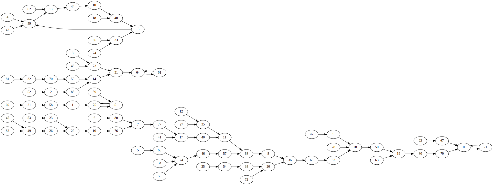
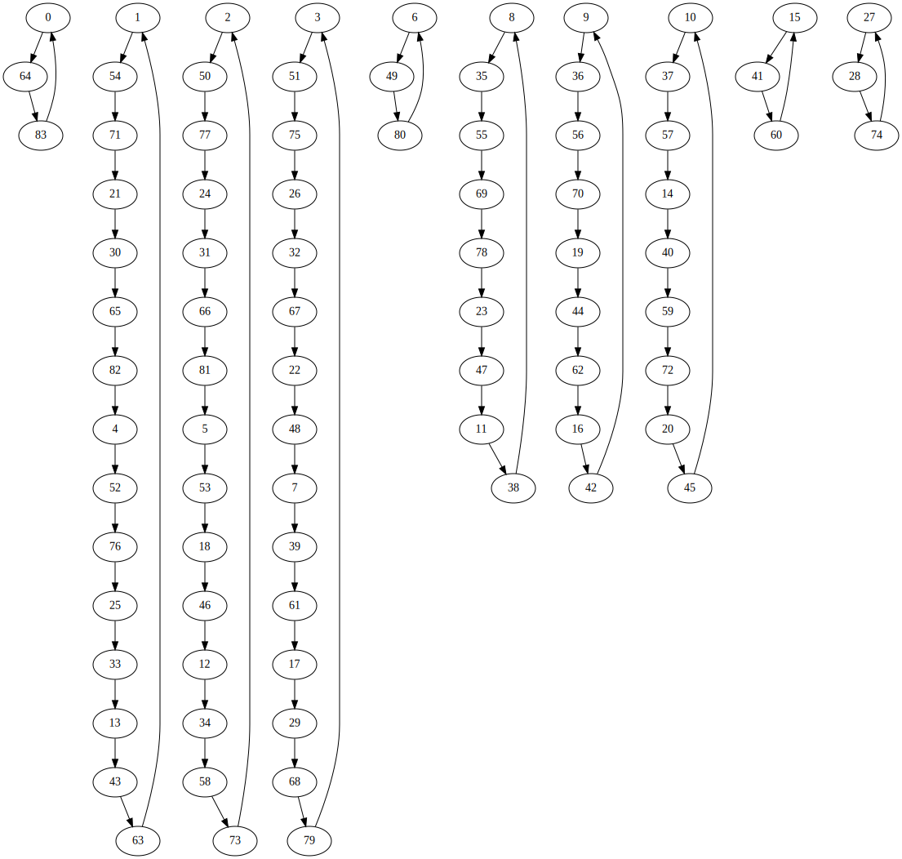

[ctftime link](https://ctftime.org/task/11304)
Category: Crypto

Challenge reads a lua file from input, then creates two instances of state Alice and Bob. This sounds like some kind of protocol for interacting between two parties. Multiple iterations of checks are then run using lua code. There are two parts of the checks.

In both cases solution needs to implement two functions `Alice` and `Bob` such that `verify(Bob(Alice(input)), input)` where verify is implemented by challenge return type of `Alice` is limited making it difficult to transfer required information.

# Part 1

In the first check Alice is given 8 random cards from of deck of 40000. She has to remove one of them and give remaining ones in some order to Bob. Bob then has to guess what was the eighth card.

Only way of transferring information is through the order of cards passed. `7! = 5040`. That is insufficient to encode the number of card. Instead of choosing the card to remove arbitrarily it can be chosen based the 8 cards given. 

Calculate sum of cards  modulo 8. And remove this card. Then encode `card / 8` in remaining 7 cards. `40000/8 == 5000` which is less than `7!`.

```python
def Alice1(hand):
    removed_card_index = sum(hand) % 8
    hand = sorted(hand)
    removed_card= hand[removed_card_index]
    hand.remove(hand[removed_card])

    return itertools.permutations(hand)[removed_card // 8]
```

Bob then has to calculate which permutation `n` the given card form and choose the correct card in range `[8n, 8n + 8)`. Each of the card this range have different value modulo 8 so each of them would cause Alice to choose different card for removal so only one of the 8 cards identified by permutation doesn't contradict card removal algorithm used by Alice.

```python
def Bob1(hand):
    n = permutation_number(hand)
    hand = sorted(hand)
    for i in range(8 * n, 8 * n + 8):
        position = (sum(hand) + i) % 8
        if i > hand[position-1] and i < hand[position]: # actual code need to check bounds
            return i
```

I initially implemented both Alice and Bob using next_permutation function. It turned out to be too slow, ~25 seconds on my computer. I found this only after implementing the part 2 and trying to submit solution. Each call to Alice and Bob don't take too much but in case of 10000 iterations used by challenge it adds up.

Converting permutation to it's number in the lexicographical order is quite easy, especially since the number of card is small so doing it `O(n^2)` is acceptable.


```lua
FACTORIAL = {1, 2, 6, 24, 120, 720, 5040}

local n = 0
for i = 1, 6 do
    local less = 0
    for j = i+1, 7 do
        if hand[j] < hand[i] then
            less = less + 1
        end
    end
    n = n + less * FACTORIAL[7 - i]
end
```

Doing the opposite for Alice is a bit is  a bit more tricky. There are algorithms for this but i didn't want to write and debug one in Lua. So instead i precalculated all permutations of 7 numbers in a global variable using `next_permutation` which I had already written for my initial slow implementation.

This part is more or less the same task [MMMAGIC6](https://www.spoj.com/problems/MMMAGIC6/) on competitive programming(algorithm and datastructure challanges) site https://spoj.com but with slightly different constants. Supposedly it is also the same as task from [MWPZ](http://mwpz.poznan.pl) 2007 contest in Poland.


# Part 2

Alice is given ordered list of 96 card, 64 of them are labeled as `1` and 32 are labeled as `2`. She has to choose 32 cards labeled `1` and tell their positions to Bob. Using this information Bob has to figure out the positions of `2`.

The task is equivalent to making a permutation function `f(x)->y`, where x and y both are 96 bit numbers with 32 bits set.


The function must be a bijection so that it can be reversed, argument and value belongs to the same set so it is a permutation.

Commonly used method is to bruteforce the small cases and look if there are any useful patterns. So I wrote a backtracking algorithm which searches for sequence of `C(3*k, k)` combinations where two consecutive values don't have common positions. It worked for `C(6, 2)` but it didn't notice any obvious patterns that would be useful for solution. My next guess what it's possible to construction a permutation such that all loops have length 3.  For the all the values i tried  `binomial(3k, k)` was dividable by 3 so no contradiction yet.  Short cycles would allow calculating the inverse quickly by applying the function twice. So i adjusted the backtracking to use this restriction. It worked for `C(6,2)` but on either `C(9, 3)` or `C(12, 4)` it wast too slow so I wasn't able to fully confirm my theory. Neither did I know how to construct such permutation efficiently.

I tried out a few more ideas. First part made me think of it as combinations `C(96, 32)`, `C(64, 32)` and converting combination to it's number in lexicographical order. Sagemath has the builtin functions for doing this easily while prototyping ideas. This lead me into a bunch more dead-ends. During my attempts I printed the resulting structure using `graphviz`. That gave me a bunch of images like this:



Some loops with a bunch of trees attached - not a permutation.

At this point I started to think that I am overcomplicating things. One of my early ideas was bit rotation. It can be easily calculated in both direction and in case of all `1` bits being sufficiently spaced out it even work correctly. I initially threw away this idea because it doesn't work when you have group of more than one bit set. What if the bits in such situation keep were pushed further until first free space.

```
_X___XX_____XX_X___
__X____XX_____X_XX_ // forward
_X___XX_____XX_X___ // backward
```
Trying it out on paper seemed to work, even for some trickier cases. So I quickly implemented in python reusing code from my previous tests.

Basic idea looks something like this
```python
N = 96
def rotate_left(v):
    result = 0
    bits = 0
    i = 0
    # Shouldn't take more than 2 loops due to number of bits set being N/3
    while i < N or bits > 0:
        pos = i % N
        if v & (1 << pos) and i < N: # i < N to ensure that single bit doesn't get taken twice
            bits += 1
        if v & (1 << pos) == 0 and # don't put in position that initially had 1
            result & (1 << pos) == 0: # don't put in position that's already filled
            bits -= 1
            result |= (1 << pos)
        i += 1

def rotate_right(v):
    return reverse(rotate_right(reverse(v)))
```



Looks like a permutation to me. Since rewriting in Lua and debugging lua script will take some time, better make sure that it works correctly in all corner cases using python.


```
K = 4 # 32
N = 3 * K
c = Combinations(N, K)
for i in range(c.list()):
    bits = combination_to_bits(i, N)
    next = rotate_right(bits)
    prev = rotate_left(next)
    if bits != prev:
        print("Bad")
        break
```

In some cases it work quite right, probably due staring somewhere inside group of `1`. Changing starting offset somewhere inside a bunch of `0` helped.

```python
   pos = (i + offset) % N
```
 There are probably multiple ways of doing this. I did this by counting prefix sum, +1 for each 1, -1 for 0. Position with lowest value was chosen as starting offset.

I previously wrote that backtracking on small cases didn't give any obvious patterns. Now that I have solved the task I remember that rotation pattern was visible in the solution found by backtracking, but I decided to ignore it thinking that it only works with `N=6, K=2` and doing it with bigger sizes would produce overlap.