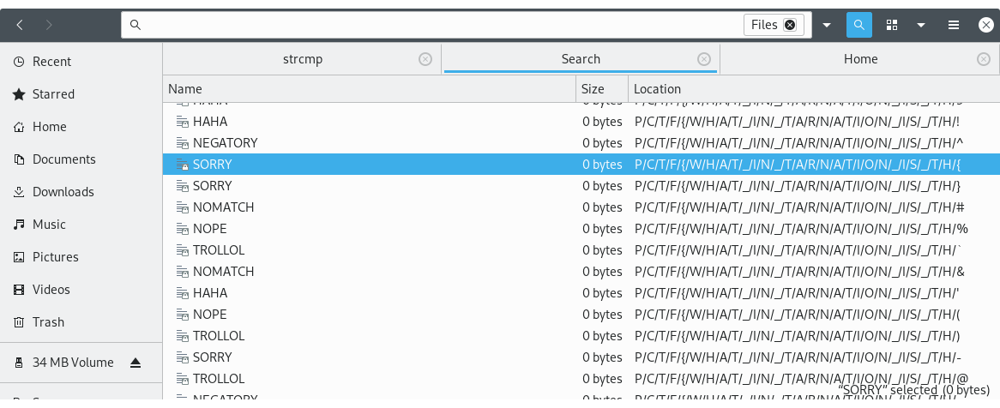

[constest link](https://ctftime.org/event/936)

From the the name it's possible to guess that file is most likeyl fat32 disk image, but lets verify it using `file`.
```
$ file strcmp.fat32
strcmp.fat32: DOS/MBR boot sector, code offset 0xfe+2, OEM-ID "strcmp  ", reserved sectors 8, FAT  1, Media descriptor 0xf8, sectors/track 1, heads 1, sectors 66057 (volumes > 32 MB), FAT (32 bit), sectors/FAT 513, reserved 0x1, dos < 4.0 BootSector (0x0)
```
Indeed it is. Interface for `mount` command has been improved so there is no need to remember how to setup loop device anymore. `mount strcmp.fat32  mount_folder` works, doesn't even need an explicit loop option.

A bunch of similar looking directories with with more them inside, probably recursive. Before pulling out forensics tools let's try searching fore files first to get a better feeling of what we are dealing with.

I am using nautilus. In search options it's possible to select "What/Files". Scroll around a bit. What's that? Looks like beginning of flag.



A little bit more scrolling.


That was easier than expected, but flag is a flag.